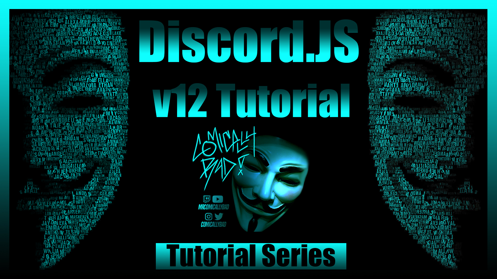

# ComicallyBad Discord.js v12 Tutorial Series Repository

To get started:
1. Install VSCode from: https://code.visualstudio.com/download/
2. Install Node from: https://nodejs.org/en/download
3. Install GIT from https://git-scm.com/downloads

For running code from specific episodes follow these instructions:
1. Clone the github repository: navigate to destinated folder location, then use `git clone https://github.com/comicallybad/Discord.js-v12-Tutorial`
2. Open the cloned folder in VSCode, type `cd <episode directory name>`
3. Use `npm install --save`
4. Add your saved `.env` file to the folder
5. Use `nodemon` or `node index.js`

For support:
1. Check discord.js documentation at: https://discord.js.org/#/docs/main/stable/general/welcome
2. Join our discord, become a member, and join the coding category: https://discord.gg/jK2JQVc
3. Leave a comment on the YouTube and I, or someone else will try to respond ASAP

Credit to these other YouTubers:
1. [MenuDocs]: Youtube: https://www.youtube.com/channel/UCpGGFqJP9vYvzFudqnQ-6IA
2. {TheSourceCode}: YouTube: https://www.youtube.com/channel/UCNXt2MrZaqfIBknamqwzeXA
